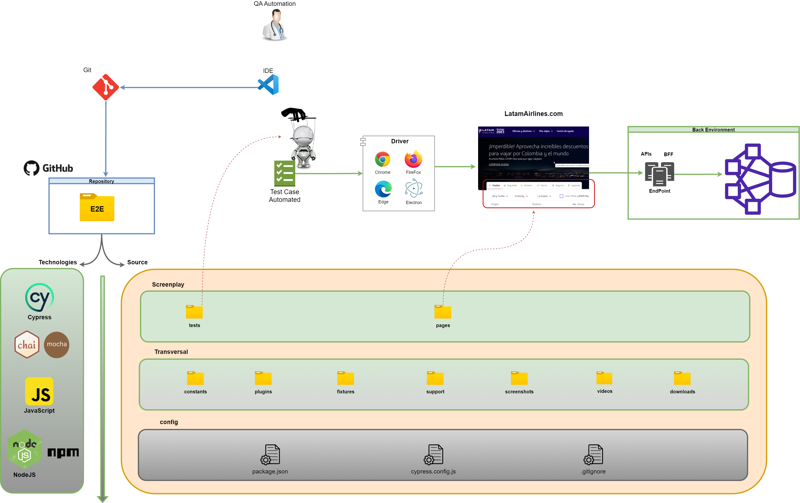

# 🦾 Automatización de Pruebas WEB - LatamAirlines 🦾

Este proyecto de automatizacion API hecho en JavaScript-NodeJS/npm con Cypress y Screenplay-pattern, 
refleja los scripts de pruebas automatizadas sobre diferentes servicios API para su consumo desde www.demoblaze.com

<br>

<div id='menu'/>

## 📚 Tabla de contenido: 
1. [Arquitectura](#arquitectura)
   1. [Diagrama Conceptual](#arquitectura_diagrama_conceptual)
   2. [Estructura de Proyecto](#arquitectura_estructura_proyecto)
2. [Tecnologias / Herramientas](#tecnologias_herramientas)
3. [Pre-requisitos](#pre_requisitos) 
4. [Instalación](#instalacion) 
5. [Ejecución](#ejecucion) 
6. [Informe](#informe)
7. [Ambiente](#ambientes)
8. [Autores](#autores) 

<br>

<div id='arquitectura'/>

##  📐 Arquitectura [📚](#menu)

<br>

<div id='arquitectura_diagrama_conceptual'/>

### Diagrama Conceptual [📚](#menu) 


[Generado en draw.io](https://app.diagrams.net/): ../diagrams/readme/diagrama_conceptual_arquitectura.drawio

<br>


<div id='arquitectura_estructura_proyecto'/>

## 📂 Estructura de Proyecto [📚](#menu) 

### 📁 support: [./cypress/]
>Clases de soporte, comandos, arranque y temas transversales que rodean a los test
### 📁 tests: [./cypress/e2e/.../]
>Clases que agrupan (describe) y contienen los test (it)  (lanzadores)
### 📁 pages: [./cypress/e2e/pom/.../]
>Clases que describen todo lo relacionado a una pagina o parte de ella, sus elementos, comportamientos, interacciones y comprobaciones

<br>

<div id='tecnologias_herramientas'/>

## 🛠️ Tecnologias / Herramientas [📚](#menu) 

| Proposito                  | Tecnologias        | Herramientas                |
|----------------------------|--------------------|-----------------------------|
| Pruebas Automatizadas      | Cypress            | cypress:run, cypress:open   |
| Pruebas                    | Mocha, Chai        |                             |
| Lenguaje de programación   | JavaScript         |                             |
| Gestor de dependencias     | NodeJS             | npm                         |
| Versionamiento             | Git                | GitHub, GUI/Bash            |
| IDE                        |                    | VSCode                      |
| Request details            | dev tools browser  | Network, Console            |


<br>

<div id='pre_requisitos'/>

## 📋 Pre requisitos - local [📚](#menu) 

1. NodeJS v20.10.0
2. npm v10.2.3
3. Cypress v13.6.0
4. IDE Visal Studio Code
5. Git (GUI/Bash)


<br>

<div id='instalacion'/>

## 📦 Instalación [📚](#menu)

1. Clonar/descargar proyecto
* Via HTTPS:
```
git clone https://github.com/hcuenca8/test-aut-cy-web-latamairlines.git
```
* Via SSH: (requiere generar key SSH)
```
git clone git@github.com:hcuenca8/test-aut-cy-web-latamairlines.git
```
2. Abrir proyecto en IDE (VSCode o de su preferencia)
3. Gestionar dependencias con NodeJS-npm
```
npm install
```

<br>

<div id='ejecucion'/>

### 🤺 **Ejecución** [📚](#menu) 
Para ejecutar las pruebas automatizadas, 
1. Ingrese al runner de Cypress desde la consola/terminal/shell dentro del proyecto en el IDE, a traves de:
```
npm run cypress:open
```
2. Se abrira la portada de bienvenida de Cypress, elija la seccion de E2E Testing
3. Se le presentara la gama de navegadores, elija el de su preferencia para llevar a cabo la prueba
4. De inicio al E2E Testing
5. Se desplegara una nueva ventana con los specs (archivo estandar que contiene los test), alojados en el proyecto, elija el spec de interes a ejecutar
6. A continuación se ejecutaran las pruebas alojadas en dicho spec 

<br>

<div id='ambientes'/>

## 📬 Ambientes [📚](#menu) 
	
* Publico
    + Ambiente de prueba
      + 📦 https://www.latamairlines.com/co/es

<br>

<div id='autores'/>

##  ✍️️ Autores [📚](#menu)️ 
**QC Automation / Analyst Testing**
<br>**👨🏻‍💻 Hector Fabio Cuenca Madrid** - hcuenca8@gmail.com
<br>https://www.linkedin.com/in/hector-fabio-cuenca-madrid-3078591b9/

<br>

<!--- comentarios
Visor readme online
    https://stackedit.io/app#
urls emojis icons & symbols
    https://emojikeyboard.org/
    https://www.piliapp.com/emoji/list/?skin=1f3fc

Icons para uso 
    🚧 TODO

Markdown
    Tabla de contenido:
        1. [Example](#id)

    Lista desplegable
        + 
